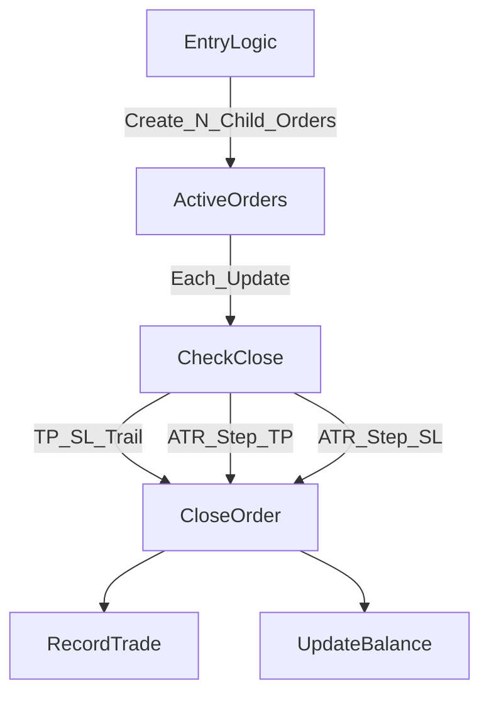

# Plan: ATR-Step Partial Close via Split Orders

## Context and Intended Behavior

- Goal: implement partial close behavior by **opening multiple fixed-size child orders** (no reduce-position support) and closing those child orders at ATR step targets.
- Steps are measured from **original entry price** at `n*ATR`, `2n*ATR`, ... in profit direction, and similarly `n*ATR`, `2n*ATR`, ... against for loss-based exits.
- Each child order size is `EACH_TRADE_SIZE`, repeated until total equals `FIXED_LOT`.
- Enforce **exact multiplier**: `FIXED_LOT % EACH_TRADE_SIZE == 0`. If not, raise a clear error so the user sees it.

## Files to Change

- `/home/bruno/programming/python/tradingBots/FVG_projectX_bot/FVG_strategy.py`
- `/home/bruno/programming/python/tradingBots/FVG_projectX_bot/backtest/FVG_backtest.py`
- `/home/bruno/programming/python/tradingBots/FVG_projectX_bot/projectX/FVG_projectX.py`
- (No changes to `/home/bruno/programming/python/tradingBots/strategyTemplate.py` unless a shared helper is needed; prefer keeping logic in `FVG_Strategy`.)

## Implementation Plan

1. **Add configuration constants in `FVG_strategy.py**`
  - Add new constants near the existing configuration block:
    - `EACH_TRADE_SIZE` (child order size)
    - `PARTIAL_TP_ATR_STEP` (X in ATR multiples for favorable partials)
    - `PARTIAL_SL_ATR_STEP` (Y in ATR multiples for adverse partials)
    - Optional toggle(s): `ENABLE_PARTIAL_TP`, `ENABLE_PARTIAL_SL` (if you want to quickly enable/disable each direction).
  - Keep names descriptive and consistent with existing settings like `SL_MULTIPLIER`, `TP_MULTIPLIER`.
2. **Validate fixed-lot split requirements early**
  - In `FVG_Strategy.__init__` (or a helper called from it), validate:
    - `USE_FIXED_LOT` must be `True` for this mode.
    - `FIXED_LOT` is a multiple of `EACH_TRADE_SIZE`.
  - If invalid, raise a `ValueError` with a clear message explaining the mismatch and the required relationship.
3. **Split entry into multiple child orders**
  - In `FVG_Strategy.entry_logic`, when creating orders:
    - Compute `num_orders = FIXED_LOT / EACH_TRADE_SIZE`.
    - Instead of one order, open `num_orders` separate orders of size `EACH_TRADE_SIZE`.
    - Each child order should record:
      - `entry_price`, `entry_atr`, `take_profit`, `stop_loss`, `trailing_stop_loss` (same as now).
      - A shared reference point for **original entry price** if needed for partial close logic.
  - Ensure pyramiding logic still works with multiple active orders (it already iterates a list).
4. **Track partial-close steps per order**
  - Extend `FVG_Order` to track:
    - `entry_reference_price` (use the original entry price for step calculations).
    - `next_tp_step_idx` and `next_sl_step_idx` (step counters starting at 1).
  - Initialize these on order creation.
5. **Implement partial-close checks in `FVG_Order.check_close_conditions**`
  - After existing TP/SL/Trailing checks, add logic for ATR-step partial closes:
    - Compute favorable and adverse thresholds based on `entry_reference_price` and `entry_atr`:
      - For BUY: favorable threshold = `entry + (PARTIAL_TP_ATR_STEP * entry_atr * next_tp_step_idx)`.
      - For BUY: adverse threshold = `entry - (PARTIAL_SL_ATR_STEP * entry_atr * next_sl_step_idx)`.
      - Reverse for SELL.
    - If price crosses favorable threshold, **close this child order** and increment `next_tp_step_idx`.
    - If price crosses adverse threshold, **close this child order** and increment `next_sl_step_idx`.
  - Ensure TP/SL hard exits still take precedence and end the order immediately.
6. **Wire partial-close results into strategy bookkeeping**
  - Confirm that existing loops in `FVG_Strategy.update_price` and `FVG_Backtest.run` already close orders independently (they do).
  - Ensure closing any child order updates:
    - `pyramiding.on_position_closed` (already called).
    - `lastPositionWasLong/Short` flags and trade counters (should reflect remaining open orders).
  - In backtest, ensure trade logs and account balance updates reflect each closed child order.
7. **Backtest and broker integration checks**
  - `FVG_Backtest`:
    - Verify that `BacktestOrder.close_order` uses `order_size` (child size) for PnL, which is correct for partial closes.
  - `FVG_projectX.py`:
    - Ensure order placement uses `order_size` for the request; no reduce-position operations are required.
8. **Add minimal documentation in PLAN.md and test guidance**
  - Note the new constants and required fixed-lot multiple behavior.
  - Suggest a quick backtest scenario with a known dataset and small `EACH_TRADE_SIZE` to observe multiple child orders closing at ATR steps.

## Critical Code References

- Order close flow: `/home/bruno/programming/python/tradingBots/FVG_projectX_bot/FVG_strategy.py` (method `FVG_Order.check_close_conditions`).
- Entry logic / order creation: `/home/bruno/programming/python/tradingBots/FVG_projectX_bot/FVG_strategy.py` (method `entry_logic`).
- Backtest order accounting: `/home/bruno/programming/python/tradingBots/FVG_projectX_bot/backtest/FVG_backtest.py` (`BacktestOrder.close_order`, `_record_trade`).
- Broker order placement: `/home/bruno/programming/python/tradingBots/FVG_projectX_bot/projectX/FVG_projectX.py` (`ProjectX_Order.place_order`).

## Optional Mermaid (Data Flow)

