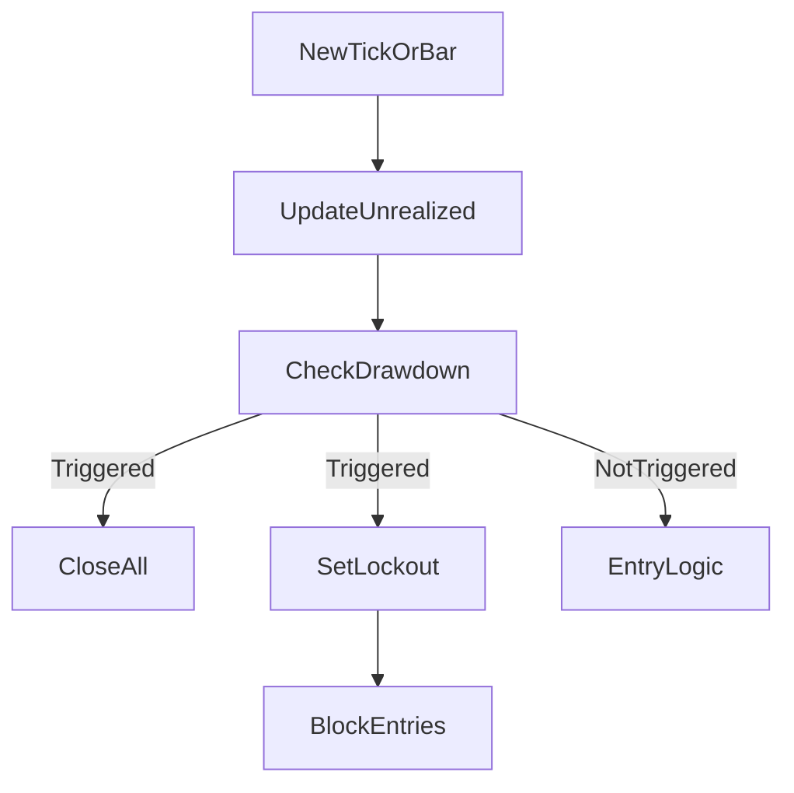

# Plan: Max Drawdown Protection + PnL Close Print

## Goals

- Add a per‑strategy max drawdown guard based on **unrealized PnL**, not account balance.
- If drawdown from **all‑time peak unrealized PnL** exceeds a configurable % (e.g., 50%), close all open positions and block new entries until the next trading day.
- Use **timestamp‑based day** (from bar/tick timestamp) so it works in backtests and live.
- Print PnL when a position closes (per position, not total).

## Files to Change

- [FVG_strategy.py](/home/bruno/programming/python/tradingBots/FVG_projectX_bot/FVG_strategy.py)
- [FVG_backtest.py](/home/bruno/programming/python/tradingBots/FVG_projectX_bot/backtest/FVG_backtest.py)

## Implementation Steps

1. **Add configuration constants in `FVG_strategy.py`**
  - `MAX_DRAWDOWN_ENABLED = True/False`
  - `MAX_DRAWDOWN_PCT = 50.0` (percent drawdown from peak unrealized PnL)
2. **Track unrealized PnL and peak per strategy instance**
  - Add instance state in `FVG_Strategy.__init__`:
    - `self._peak_unrealized_pnl = 0.0`
    - `self._max_dd_triggered_until = None` (date string or date object)
  - Add helper method to compute **current unrealized PnL** across active orders:
    - For live/backtest: sum per‑order unrealized PnL using current price (close or tick).
    - Use order size and side to compute PnL; reuse existing order data where possible.
3. **Implement drawdown check and lockout**
  - Create a method in `FVG_Strategy`:
    - `def _check_max_drawdown(self, current_timestamp):`
    - Update peak if current unrealized PnL > peak.
    - Compute drawdown % from peak; if exceeds `MAX_DRAWDOWN_PCT`, close all open orders and set lockout until next trading day.
  - Lockout logic:
    - Determine trading day from `current_timestamp.date()`.
    - Set `self._max_dd_triggered_until = next_day_date`.
  - Add guard in entry logic:
    - If `MAX_DRAWDOWN_ENABLED` and today < lockout date, skip entries.
4. **Wire drawdown checks into live and backtest flows**
  - In `FVG_Strategy.update_price` and `bar_iteration`:
    - Call `_check_max_drawdown(self._current_dt or timestamp)` before entry logic.
  - In `FVG_backtest.run`:
    - Call `_check_max_drawdown(self._current_dt)` each bar before entry logic.
5. **Close all open positions on trigger**
  - Implement a helper in `FVG_Strategy` to close all `active_orders` cleanly:
    - Set `exit_reason = "max_drawdown"`
    - Use the current price/timestamp for exit metadata.
    - Reuse existing close flow so PnL is recorded consistently.
6. **Add per‑position PnL print on close**
  - In `FVG_Strategy` close handling (or `BacktestOrder.close_order` where applicable):
    - Print a concise message including side, size, exit price, and realized PnL for that position.
  - Ensure it fires for normal exits and max‑drawdown exits.

## Notes / Edge Cases

- If peak unrealized PnL is 0 or negative, treat drawdown as 0 (avoid divide‑by‑zero).
- Use timestamp from the bar/tick for day boundaries so backtest and live align.
- Keep drawdown tracking per strategy instance (per asset), not global across strategies.

## Optional Mermaid (Flow)

